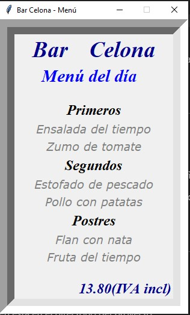

# Gestor de Restaurante - Menú del Día

Aplicación en Python que permite gestionar el menú de un restaurante mediante una base de datos SQLite. Incluye una interfaz gráfica en Tkinter para mostrar el menú del día y funcionalidades para agregar categorías y platos desde consola.

## Funcionalidades
- **Gestión de categorías**: Añadir categorías al menú desde la consola.
- **Gestión de platos**: Asociar platos a categorías existentes.
- **Visualización del menú**: Interfaz gráfica sencilla desarrollada en Tkinter.

## Vista de la Interfaz Gráfica

